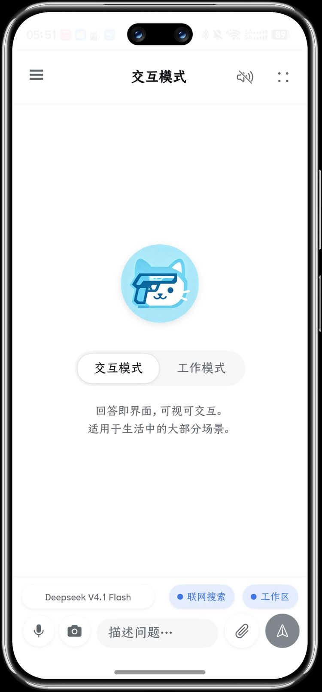
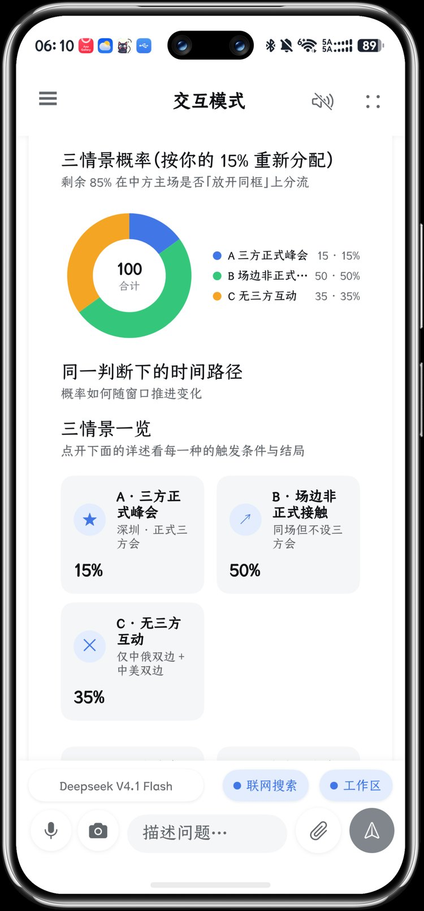
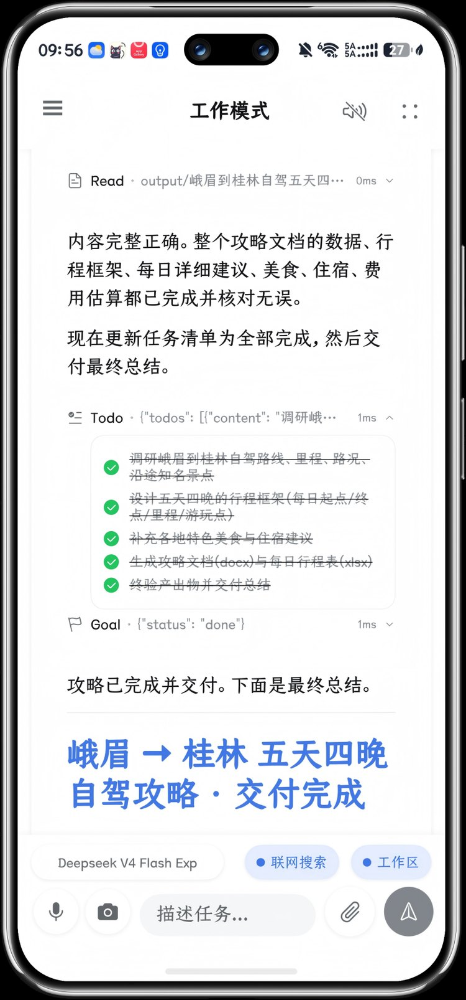
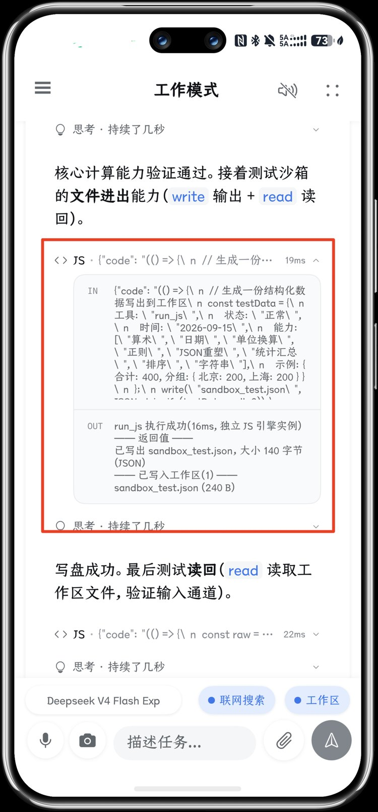

# Guncat Work

> 中文 | [English](README_EN.md)

**鸿蒙掌上 Codex** —— 用 ArkTS / ArkUI 从零构建的原生 HarmonyOS AI 客户端。**两个当红形态都在端侧真机跑通**：**Intelligent UI**（一句话直出可操作界面，对标 GPT 的 Intelligent UI）与 **Harness**（Codex 式多轮 Agent Loop + 沙箱工作区，DeepSeek Harness 的端侧移植）。模块化内核 + 三协议流式对话 + 45 个内置工具 + 32 个技能，设备端直出 PPT / Word / Excel / SVG。

<!-- 演示位（可选升级）：真机录屏 30–60 秒 —— 进工作模式 → 一句话生成 PPT → 产物卡片展开 → 切到交互模式拖滑块重算。动态 GIF 比静态截图更有说服力。 -->

-blue)


[](LICENSE)
[](https://github.com/zhubowen-bot/Guncat-Work-for-hmos/actions/workflows/ci.yml)

<p align="center">
  <a href="docs/images/interactive-home.jpg"></a>
  <a href="docs/images/interactive-ui.jpg"></a>
  <a href="docs/images/work-delivery.jpg"></a>
  <a href="docs/images/run-js.jpg"></a>
</p>

<p align="center"><sub>交互模式首页 · 交互模式直出的可操作界面 · 工作模式长程任务交付 · <code>run_js</code> 设备内 JS 沙箱　（点击任意一张放大）</sub></p>

## 两个当红形态，都在端侧真机跑通

| 形态 | 对标 | 在 Guncat Work 里的样子 |
| --- | --- | --- |
| ✦ **交互模式** | GPT 的 **Intelligent UI** | 一句话进来，一张**能拖、能点、能改参数并即时重算**的原生界面出去：图表 / 表格 / 指标卡 / 选项卡 / 表单控件全部原生渲染，默认零工具调用、一轮直出 |
| 🛠 **工作模式** | **DeepSeek Harness**（dsh，Codex 式 Agent Loop） | 多轮工具循环 + 每会话独立沙箱工作区 + 45 个内置工具，长程任务自主执行，端侧直出 PPT / Word / Excel / SVG，产物卡片附行级 diff |

两个形态**共用同一套 Agent Loop 与沙箱工作区**，差别在行为纪律与**下发的工具面**——工作模式是「45 个内置工具全量 + 多轮工具循环 + 长程交付」，交互模式只下发 **27 个**（读素材 / 算真实数字 / 核实外部事实 / 出文件），长程工具（`todo_write` / `goal_*` / `schedule_*` / `subagent` …）根本不出现在它的请求里，所以是「快车道、一轮直出界面」。应用启动默认落在交互模式，空态大标题处的「交互模式 / 工作模式」胶囊可一键换挡。

交互模式复刻的是 GPT 那套 Intelligent UI 的交付方式：回答不再是纯文本，而是一份**界面程序**，由应用渲染成原生可操作界面——柱状 / 折线 / 面积 / 横向条 / 饼环 / 径向 / 雷达 / 堆叠条、表格、指标卡、图片墙、选项卡 / 折叠面板 / 步骤条 / 卡片块，以及整套表单控件（滑块 / 开关 / 单选 / 多选 / 下拉 / 标签选择 / 选项卡 / 输入框 / 文本域）；控件的取值还能回传模型触发重算。工作模式则把 DeepSeek Harness（dsh）的核心 Agent Loop 完整移植到了端侧。

对上游的研究材料也在仓库里：[open-intelligent-ui 规格](docs/reference/open-intelligent-ui-spec.md) · [openui-lang 规范](docs/reference/openui-lang-spec.md)。

## 这是什么

Guncat Work 支持完整丰富的客户端功能：聊天模式内置通用、论文转换、法律 / 研究 / 筛滤检索与 LLM 评测等智能体；支持 Chat / Responses / Anthropic 三种主流协议接入、原生 Markdown（含 LaTeX 公式与 Mermaid 图表）、图片文档直传、CoreSpeechKit 朗读和原生语音输入等扩展 C 端功能。

工作模式带沙箱工作区与工具调用能力，包含 45 个内置工具，覆盖文件增删改查与模式匹配搜索、任务清单、图片查看、网络下载、PDF 解析、Office 生成与读写编辑（PPT / Word / Excel 各自基于 JSON 中间层，可无损读回、算子式编辑）、数据管道清洗转换与格式互转，以及基于 JSVM-API 的 JS 执行沙箱 `run_js`。内置 32 个技能（5 个主 Skill 路由 + 7 个格式分支）把 PPT 设计规范、Doc JSON 语法、数据清洗配方等领域知识按需加载给模型。Office 文档与 PDF 全部本地解析，不消耗多模态配额。

界面在手机与桌面之间自适应：宽屏（≥700vp）展开「左侧栏 / 会话列 / 工作区详情列」三栏布局，窄屏回退单列加抽屉。工作区文件可原地预览、一键分享，生成与改动附行级 diff，对话历史、配置与朗读偏好均本地持久化。工程上采用 MVVM 分层，三协议 SSE 统一进协议适配层，每个文档生成器都配有针对性的离线验证环境（Node 构建 + Python 结构校验 + tsc 类型检查）。

当前应用版本：`6.3.0` · 完整变更见 [更新记录](CHANGELOG.md)

## 能力概览

- **两种当红 Agent 形态**：**交互模式**对标 GPT 的 Intelligent UI —— 一句话进来，一张能操作的界面出去，默认零工具调用、一轮直出，界面里的滑块、开关、下拉即时重算；**工作模式**是 DeepSeek Harness 的端侧移植 —— 多轮工具循环 + 沙箱工作区 + 长程交付（产物卡片附行级 diff）。
- **三协议接入**：OpenAI Completions（`/chat/completions`）、OpenAI Responses（`/responses`）、Anthropic Messages（`/messages`），均支持图片直传；深度思考与联网搜索按各协议显式控制。
- **内置本地联网搜索**：软件内置、无需手动开关，工作模式与聊天模式都能调用，不受制于服务端联网开关。
- **端侧直出 Office**：PPT / Word / Excel / SVG 由本地生成器产出，基于 JSON 中间层，文档可无损读回、算子式编辑；PDF 与 Office 全部本地解析，不消耗多模态配额。
- **45 个内置工具**：文件增删改查与模式匹配搜索、任务清单、图片查看、网络下载、PDF 解析、Office 读写、数据管道清洗转换与格式互转，以及基于 JSVM-API 的 `run_js` 代码沙箱（不联网、不读写文件系统，后台线程执行并带超时保护）。
- **32 个技能**：5 个主 Skill 路由 + 7 个格式分支，命中即按需加载；PPT / Word / Excel 三个技能采用「门」式约束，交付前生成可核对的自检报告。
- **原生 Markdown**：CommonMark 与 GFM 常用语法、代码高亮、表格、任务列表、LaTeX 行内与块级公式、Mermaid 图表，深浅色主题自动适配。
- **附件与分享**：图片 / 文档直传或预解析、256px 缩略图、快捷拍照、导出 Markdown 回答为 Word（含 LaTeX → OMML 原生公式）、接收 HarmonyOS 系统分享。
- **语音**：CoreSpeechKit 朗读（可切换系统音色与倍速、支持锁屏与后台继续、控制条可拖动）与原生语音输入。
- **自适应界面**：宽屏三栏、窄屏单列加抽屉；跟随系统切换深浅色主题，并同步状态栏、导航栏与 Markdown 样式。

完整功能清单与实现细节见 [主要功能](docs/features.md)。

## 快速开始

### 环境要求

- DevEco Studio 6.0.1 或兼容版本
- HarmonyOS SDK API 24（`6.1.1`）
- HarmonyOS 手机真机

### 构建

使用 DevEco Studio 打开项目后，配置签名并运行 `entry` 模块即可。命令行构建示例：

```bash
hvigorw --mode module -p product=default -p module=entry@default -p buildMode=debug assembleHap
```

构建步骤：

1. 克隆或下载项目。
2. 使用 DevEco Studio 打开**仓库根目录**。
3. 安装并选择 HarmonyOS SDK API 24。
4. 配置调试或发布签名。
5. 连接 HarmonyOS 真机。
6. 运行 `entry` 模块，或使用上述命令构建 HAP。

### 首次配置

应用设置中可保存并切换多套 API 配置：

1. 接入方式（`openai-completions` / `openai-responses` / `anthropic-messages`）
2. Base URL
3. API Key
4. Model
5. Temperature、Top P、最大输出 Token 等可选参数
6. 额外请求参数

常用兼容地址：

- DeepSeek Responses：`https://api.deepseek.com`
- DeepSeek Anthropic：`https://api.deepseek.com/anthropic`，也可直接填 `https://api.deepseek.com`（应用自动补全 `/anthropic/v1/messages`）
- 火山方舟 Responses：`https://ark.cn-beijing.volces.com/api/v3`
- Anthropic Messages：`https://api.anthropic.com/v1`

多模态预解析可单独配置模型、地址和 API Key。

### 验证

- 纯逻辑回归（当前 **517 项**全绿）：`cd test/guncat-harness && node setup.mjs && node test-core.mjs`
- 服务层类型检查：`cd test/guncat-harness && node check-setup.mjs && npx tsc -p check/tsconfig.json`
- PPT / Word / Excel 离线验证环境：`test/pptx-harness`、`test/docx-harness`、`test/xlsx-harness`
- 真实 ArkTS 编译（需本机 DevEco）：`powershell -ExecutionPolicy Bypass -File tools/build-check.ps1`

最后一层不能省：ArkUI 有一批**只有编译器才知道**的规则（`@Builder` 方法体内不允许声明局部变量、自定义组件属性名不能与内置属性同名、`@Prop` 的 null 需要显式联合类型），而 node 侧 harness 只覆盖 `common/**` 与 `service/**` 的纯 TS，不解析 `.ets`。

前两层与三个 Office 生成器验证**已接 CI**，每次 push 与 PR 自动跑（见顶部 CI 徽章）；第三层需要本机 DevEco Studio，请在提交前自行跑一次。

## 文档

| 文档 | 内容 |
| --- | --- |
| [主要功能](docs/features.md) | 全部客户端功能与工程约定 |
| [工作模式架构与维护指南](docs/architecture/work-mode.md) | Agent Loop、45 个工具、PPT / Word 生成链路、技能系统、`run_js` 沙箱、ArkTS 落地约束 |
| [交互模式架构（Intelligent UI）](docs/architecture/interactive-mode.md) | 提示词分叉、`guncat-ui lang` 契约、流式成形、交互闭环、扩展入口 |
| [项目结构](docs/architecture/project-structure.md) | 目录布局、数据流、核心组件 |
| [使用指南](docs/guides/usage.md) | 分场景操作步骤 |
| [常见问题](docs/guides/faq.md) | 排障与已知行为 |
| [内置智能体](docs/reference/builtin-agents.md) | 智能体清单与差异 |
| [持久化与主题系统](docs/reference/persistence-and-theme.md) | 本地存储与主题实现 |
| [更新记录](CHANGELOG.md) | 4.2.0 → 6.3.0 全部版本变更 |
| [openui-lang 规范](docs/reference/openui-lang-spec.md) | `guncat-ui lang` 所对齐的上游语言实现级规范 |
| [open-intelligent-ui 规格](docs/reference/open-intelligent-ui-spec.md) | 交互模式所对齐的上游 Generated-Answer UI 规格 |

## 权限与系统能力

- `ohos.permission.INTERNET`：访问模型 API。
- `ohos.permission.MICROPHONE`：语音输入。
- `ohos.permission.KEEP_BACKGROUND_RUNNING`：朗读后台音频长时任务。
- 工作模式：文件读写全部在应用沙箱（`filesDir/workspaces/`）内完成，文件选择/保存走系统安全组件（DocumentViewPicker），**未新增任何权限**。
- Share Kit：接收其他应用分享的图片和文件。
- CoreSpeechKit：文本朗读与语音识别。
- AVSession Kit：后台媒体会话。
- ArkData Preferences：本地配置持久化；对话历史存沙箱文件 `filesDir/guncat_conversations.json`。

## 隐私说明

- API Key 和应用配置保存在应用本地沙箱。
- 聊天请求和附件只会发送到用户配置的模型服务。
- 从系统分享接收的内容不会自动发送，必须由用户主动点击发送。
- 原始附件不会作为永久文件复制到应用数据中。
- 网络请求使用 HTTPS，实际数据处理政策以所配置的模型服务商为准。

## 常见问题

遇到问题先看 [常见问题](docs/guides/faq.md)，涵盖 API Key 无效、文件解析失败、流式输出中断、图库分享列表缺失、交互模式界面没出来 / 只出一部分 / 参数调了数字没变等。

## 贡献

欢迎提交 Issue 和 Pull Request。开发环境、编码规范（ArkTS 硬约束）、三层验证怎么跑、PR 流程 → **[CONTRIBUTING.md](CONTRIBUTING.md)**。

1. Fork 仓库。
2. 创建功能分支。
3. 遵循 ArkTS 编码规范完成修改。
4. 确保项目通过类型检查和 HAP 构建。
5. 提交 Pull Request，并说明修改内容及验证方式。

## 说明

本次版本不包含曾经评估或试验过、但最终撤回的本地 TTS 模型方案；README 仅描述当前代码中实际保留的功能。

本项目基于 [Apache License 2.0](LICENSE) 开源。
